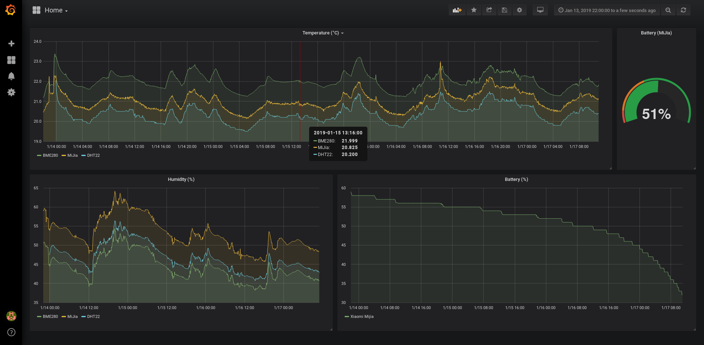

# Iteration 01

From 2019-01-13 22:00 to 2019-01-17 12:00

## Analysis

- 3 sensors:
  - DHT22 (w/ ESP8266): Sends data every 10 seconds
  - BME280 (w/ ESP8266): Sends data every 5 seconds
  - Xiaomi MiJia Mi Temperature and Humidity Meter (w/ Rpi Zero W): Sends data every 30 seconds

- The 3 sensors are located at the same place
- BME280 temperature is always ~1° more than the one reported by the MiJia
- DHT22 temperature is ~0.5° less that the MiJia
- Comparing with a Mercury thermometer, the more accurate sensor seems the MiJia
- Size of the InfluxDB database: 50MB (ramdisk 100M)
- From 58% to 32% battery life (MiJia)

## Improvements

- We need to use an external storage for InfluxDB (ramdisk is not enough - using the internal Pi sd card may damage it)
- Fetching data once every minute seems to be enough for our needs
- The Raspberry Pi 3 can do the Mijia-MQTT proxy. We don't need an additional Raspberry Pi Zero for that
- The BME280 suffers from self-heating issue in its default configuration. Optimize that code specifying the sampling rate.

## Later

- Try to fetch Mijia data once every ~5-10 minutes to save battery?
